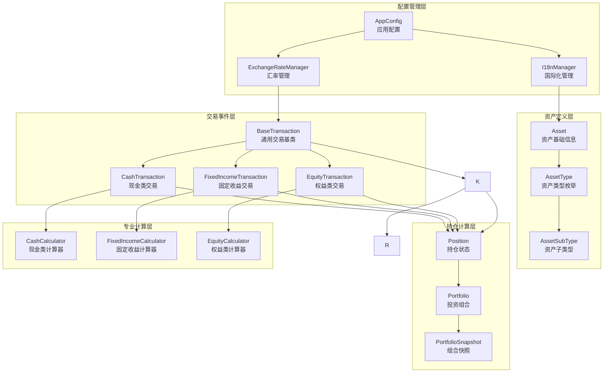
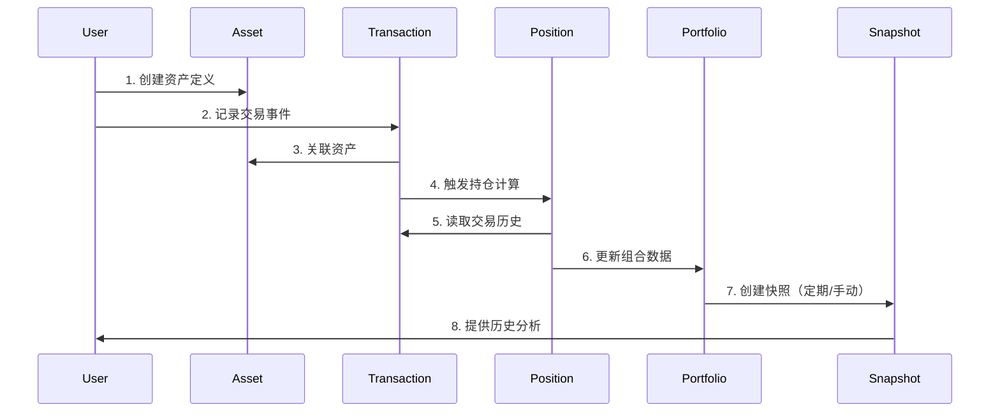
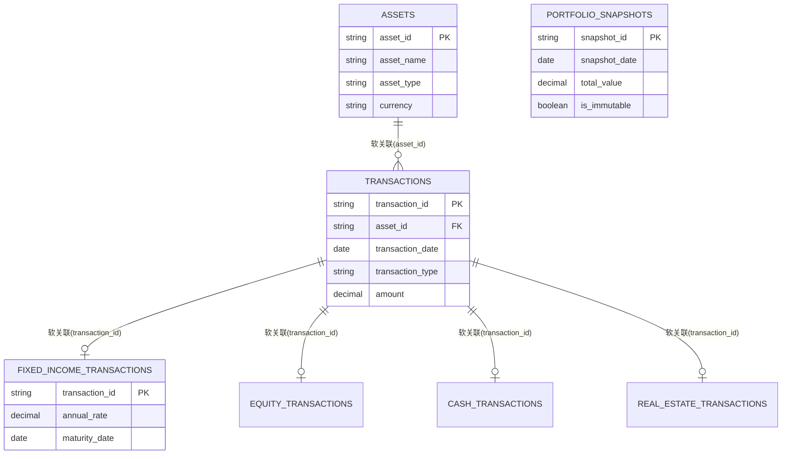

# WealthLite 数据模型关系图

## 概述

本文档详细描述了WealthLite系统中各个数据模型之间的关系、交互方式和数据流向。

## 核心设计理念

### 交易驱动的架构
- **原则**：只有交易能产生持仓
- **数据流**：Transaction → Position → Portfolio → Snapshot
- **一致性**：所有计算结果都可追溯到原始交易记录

### 职责分离
- **Asset**：管理资产静态属性
- **Transaction**：记录交易事件
- **Position**：计算持仓状态
- **Portfolio**：组合分析

## 模型层次结构



## 详细关系说明

### 1. 配置管理层

#### AppConfig（应用配置）
```python
class AppConfig:
    - base_currency: Currency = Currency.CNY
    - language: Language = Language.ZH_CN
    - decimal_places: int = 2
    - auto_backup: bool = True
    - backup_interval: int = 7
```

**关系**：
- 为整个系统提供全局配置
- 影响汇率管理和国际化显示
- 配置变更会触发相关组件重新计算

#### ExchangeRateManager（汇率管理）
```python
class ExchangeRateManager:
    - rates: Dict[CurrencyPair, ExchangeRate]
    - get_rate(from_currency, to_currency, date) -> Decimal
    - set_rate(from_currency, to_currency, rate, date)
    - get_base_currency_amount(amount, currency, date) -> Decimal
```

**关系**：
- 为Transaction提供汇率转换服务
- 支持历史汇率查询
- 与AppConfig的base_currency配置关联

#### I18nManager（国际化管理）
```python
class I18nManager:
    - current_language: Language
    - translations: Dict[Language, Dict[str, str]]
    - get_text(key: str) -> str
    - format_number(value: Decimal) -> str
    - format_currency(value: Decimal, currency: Currency) -> str
```

**关系**：
- 为所有UI组件提供多语言支持
- 与AppConfig的language配置关联
- 影响数据显示格式

### 2. 资产定义层

#### Asset（资产基础信息）
```python
class Asset:
    - asset_id: str
    - asset_name: str
    - asset_type: AssetType
    - asset_subtype: Optional[AssetSubType]
    - currency: Currency
    - description: str
    - issuer: str
    - credit_rating: str
    - extended_attributes: Dict[str, Any]
    - created_date: datetime
    - updated_date: datetime
```

**关系**：
- 被Transaction引用，建立资产-交易关联
- 通过asset_type关联到AssetType枚举
- 静态属性，不包含计算逻辑

#### AssetType（资产类型枚举）
```python
class AssetType(Enum):
    CASH = "现金及等价物"
    FIXED_INCOME = "固定收益类"
    EQUITY = "权益类"

    COMMODITY = "大宗商品"
```

**关系**：
- 被Asset引用，定义资产类型
- 决定使用哪个专业计算器
- 影响交易类型的选择

#### AssetSubType（资产子类型）
```python
class AssetSubType(Enum):
    # 现金及等价物
    SAVINGS_DEPOSIT = "储蓄存款"
    CHECKING_ACCOUNT = "活期存款"
    TIME_DEPOSIT = "定期存款"
    FOREIGN_CURRENCY_DEPOSIT = "外币存款"
    MONEY_MARKET_FUND = "货币市场基金"
    
    # 固定收益类
    GOVERNMENT_BOND = "政府债券"
    CORPORATE_BOND = "企业债券"
    BANK_WEALTH_PRODUCT = "银行理财"
    STRUCTURED_PRODUCT = "结构化理财"
    CERTIFICATE_DEPOSIT = "大额存单"
    
    # 权益类
    DOMESTIC_STOCK = "A股股票"
    FOREIGN_STOCK = "海外股票"
    MUTUAL_FUND = "公募基金"
    PRIVATE_FUND = "私募基金"
    ETF = "交易所基金"
```

**关系**：
- 被Asset引用，提供二级分类信息
- 与AssetType形成两层分类架构
- 支持类型匹配验证

### 3. 交易事件层

#### BaseTransaction（通用交易基类）
```python
class BaseTransaction:
    - transaction_id: str
    - asset_id: str
    - transaction_date: date
    - transaction_type: TransactionType
    - amount: Decimal
    - currency: Currency
    - exchange_rate: Decimal
    - amount_base_currency: Decimal
    - notes: str
    - created_date: datetime
```

**关系**：
- 所有具体交易类型的基类
- 通过asset_id关联到Asset
- 为Position计算提供数据源

#### 具体交易类型
```python
class FixedIncomeTransaction(BaseTransaction):
    - annual_rate: Decimal
    - start_date: date
    - maturity_date: date
    - interest_type: InterestType
    - payment_frequency: PaymentFrequency

class EquityTransaction(BaseTransaction):
    - quantity: Decimal
    - price_per_share: Decimal
    - dividend_amount: Decimal

class CashTransaction(BaseTransaction):
    - account_type: str
    - interest_rate: Decimal
```

**关系**：
- 继承BaseTransaction，添加特定属性
- 对应不同的资产类型
- 使用对应的专业计算器

### 4. 持仓计算层

#### Position（持仓状态）
```python
class Position:
    - asset: Asset
    - transactions: List[BaseTransaction]
    - status: PositionStatus
    - principal_amount: Decimal
    - current_value: Decimal
    - total_cost_base_currency: Decimal
    - current_value_base_currency: Decimal
    - realized_pnl: Decimal
    - unrealized_pnl: Decimal
    
    # 计算方法
    - calculate_total_return_rate() -> float
    - calculate_annualized_return() -> float
    - calculate_holding_period() -> int
```

**关系**：
- 关联一个Asset和多个Transaction
- 所有数值从交易记录实时计算
- 为Portfolio提供持仓数据

#### Portfolio（当前投资组合）
```python
class Portfolio:
    - positions: List[Position]  # 实时计算的持仓列表
    - base_currency: Currency
    - total_value: Decimal  # 实时计算
    - total_cost: Decimal   # 实时计算
    - total_return: Decimal # 实时计算
    - asset_allocation: Dict[str, Decimal]  # 实时计算
    - risk_metrics: Dict[str, float]  # 实时计算
    
    # 计算方法
    - calculate_portfolio_return() -> float
    - calculate_asset_allocation() -> Dict
    - calculate_risk_metrics() -> Dict
    - create_snapshot() -> PortfolioSnapshot  # 创建快照
```

**关系**：
- 包含多个Position，基于所有交易记录实时计算
- 会受到新增交易（包括回溯交易）的影响
- 提供最新的投资组合状态
- 可以创建PortfolioSnapshot进行历史存档

#### PortfolioSnapshot（组合快照 - 不可变）
```python
class PortfolioSnapshot:
    - snapshot_id: str
    - snapshot_date: datetime
    - base_currency: Currency
    - total_value: Decimal  # 快照时的值（不可变）
    - total_cost: Decimal   # 快照时的值（不可变）
    - total_return: Decimal # 快照时的值（不可变）
    - return_rate: float    # 快照时的值（不可变）
    - asset_allocation: Dict[str, Decimal]  # 快照时的值（不可变）
    - performance_metrics: Dict[str, float] # 快照时的值（不可变）
    - position_snapshots: List[Dict]  # 快照时各持仓状态（不可变）
    - created_date: datetime
    - is_immutable: bool = True  # 不可变标记
```

**关系**：
- 记录Portfolio在特定时间点的历史状态
- 一旦创建，不受后续任何交易影响（包括回溯交易）
- 用于历史对比、业绩评估和合规记录
- 独立于当前Portfolio，保持历史数据完整性

### 5. 专业计算层

#### 计算器接口
```python
class BaseCalculator:
    def calculate_current_value(position: Position) -> Decimal
    def calculate_return_rate(position: Position) -> float
    def calculate_risk_metrics(position: Position) -> Dict
```

#### 具体计算器
```python
class FixedIncomeCalculator(BaseCalculator):
    - calculate_maturity_value() -> Decimal
    - calculate_accrued_interest() -> Decimal
    - calculate_yield_to_maturity() -> float

class EquityCalculator(BaseCalculator):
    - calculate_dividend_yield() -> float
    - calculate_capital_gains() -> Decimal
    - calculate_beta() -> float

class CashCalculator(BaseCalculator):
    - calculate_compound_interest() -> Decimal
    - calculate_effective_rate() -> float
```

**关系**：
- 为不同资产类型提供专业计算
- 被Position调用进行价值计算
- 支持复杂的金融计算逻辑

## 数据流向图



## 关键交互场景

### 1. 新增交易场景
```python
# 1. 用户输入交易信息
transaction_data = {
    'asset_id': 'asset_001',
    'transaction_type': 'DEPOSIT',
    'amount': 10000,
    'currency': 'CNY',
    'transaction_date': '2024-01-01'
}

# 2. 创建交易记录
transaction = FixedIncomeTransaction.create(transaction_data)

# 3. 自动计算基础货币金额
exchange_rate = exchange_rate_manager.get_rate('CNY', base_currency)
transaction.amount_base_currency = transaction.amount * exchange_rate

# 4. 保存交易记录
transaction_repository.save(transaction)

# 5. 触发持仓重新计算
position = position_service.get_or_create_position(transaction.asset_id)
position.recalculate_from_transactions()

# 6. 更新组合数据
portfolio.update_position(position)
```

### 2. 组合快照场景
```python
# 1. 定期触发或用户手动触发
snapshot_trigger = SnapshotTrigger()

# 2. 收集当前组合数据
portfolio = portfolio_service.get_current_portfolio()

# 3. 计算快照数据
snapshot_data = {
    'total_value': portfolio.total_value,
    'asset_allocation': portfolio.calculate_asset_allocation(),
    'performance_metrics': portfolio.calculate_performance_metrics()
}

# 4. 创建快照记录
snapshot = PortfolioSnapshot.create(snapshot_data)

# 5. 保存快照
snapshot_repository.save(snapshot)
```

### 3. 多语言显示场景
```python
# 1. 获取用户语言设置
language = app_config.get_language()

# 2. 设置I18n管理器
i18n_manager.set_language(language)

# 3. 格式化显示数据
formatted_data = {
    'asset_name': i18n_manager.get_text(asset.asset_name),
    'amount': i18n_manager.format_currency(position.current_value, position.currency),
    'return_rate': i18n_manager.format_percentage(position.calculate_return_rate())
}
```

## 扩展性设计

### 1. 新增资产类型
```python
# 1. 添加新的资产类型枚举
class AssetType(Enum):
    # ... 现有类型
    CRYPTOCURRENCY = "数字货币"

# 2. 创建对应的交易类型
class CryptocurrencyTransaction(BaseTransaction):
    - wallet_address: str
    - network_fee: Decimal
    - confirmation_blocks: int

# 3. 实现专业计算器
class CryptocurrencyCalculator(BaseCalculator):
    def calculate_current_value(position: Position) -> Decimal:
        # 实现数字货币价值计算逻辑
        pass
```

### 2. 新增分析指标
```python
# 1. 扩展Portfolio类
class Portfolio:
    def calculate_sharpe_ratio(self) -> float:
        # 计算夏普比率
        pass
    
    def calculate_max_drawdown(self) -> float:
        # 计算最大回撤
        pass

# 2. 扩展PortfolioSnapshot
class PortfolioSnapshot:
    - risk_metrics: Dict[str, float]  # 添加风险指标
```

## Portfolio架构设计澄清

### 重要设计决策
经过深入分析，确定了Portfolio的正确架构设计：

#### 当前Portfolio（实时计算）
- **不需要数据表**：当前Portfolio应该是基于TRANSACTIONS表实时计算的结果
- **计算逻辑**：
  ```python
  def get_current_portfolio() -> Portfolio:
      # 1. 从TRANSACTIONS表获取所有交易记录
      transactions = transaction_repository.get_all()
      
      # 2. 按资产分组计算Position
      positions = []
      for asset_id in get_unique_assets(transactions):
          asset_transactions = filter_by_asset(transactions, asset_id)
          position = calculate_position_from_transactions(asset_transactions)
          positions.append(position)
      
      # 3. 聚合生成Portfolio
      return Portfolio(positions)
  ```

#### Portfolio快照（历史存档）
- **使用PORTFOLIO_SNAPSHOTS表**：存储特定时间点的Portfolio状态
- **JSON存储策略**：position_snapshots字段存储完整的持仓详情
- **不可变性**：一旦创建，不受后续任何交易影响

### 关系澄清
- **一个Portfolio包含多个Position**：每个Position对应一个Asset
- **一个Asset可以在多个Portfolio快照中出现**：但每个快照中只有一个Position
- **PORTFOLIO_POSITIONS表已移除**：避免数据重复和一致性问题

## 数据库关系设计（软外键关联）

### 设计原则
- **软外键关联**：所有表间关联采用软外键方式，无数据库级约束
- **数据完整性**：由软件层Repository和Service保证
- **灵活性优先**：避免外键约束限制，支持复杂业务逻辑
- **性能优化**：通过索引和查询优化保证性能

### 关联关系图


### 软外键实现策略

#### Repository层职责
```python
class BaseRepository:
    def validate_foreign_key(self, child_id: str, parent_table: str, parent_id: str) -> bool:
        """软外键验证"""
        return self.exists(parent_table, parent_id)
    
    def cascade_delete(self, parent_table: str, parent_id: str):
        """软级联删除"""
        # 查找所有相关子记录并删除
        pass

class TransactionRepository(BaseRepository):
    def save(self, transaction: BaseTransaction):
        # 验证asset_id存在
        if not self.validate_foreign_key(transaction.asset_id, 'assets', transaction.asset_id):
            raise ValueError("Asset not found")
        
        # 保存主交易记录
        self.save_transaction(transaction)
        
        # 保存类型特定详情
        self.save_transaction_details(transaction)
```

#### Service层职责
```python
class TransactionService:
    def create_transaction(self, transaction_data: dict) -> BaseTransaction:
        # 业务逻辑验证
        self.validate_business_rules(transaction_data)
        
        # 创建交易对象
        transaction = self.transaction_factory.create(transaction_data)
        
        # 软件事务管理
        with self.transaction_manager.begin():
            # 保存主记录
            self.transaction_repository.save(transaction)
            
            # 更新相关持仓
            self.position_service.update_position(transaction.asset_id)
            
            # 记录审计日志
            self.audit_service.log_transaction(transaction)
        
        return transaction
```

### 查询优化策略

#### 复杂查询示例
```sql
-- 获取完整交易信息（包含所有类型详情）
SELECT 
    t.*,
    a.asset_name,
    a.asset_type,
    f.annual_rate,
    f.maturity_date,
    e.quantity,
    e.price_per_share,
    c.account_type,
    r.property_type
FROM transactions t
LEFT JOIN assets a ON t.asset_id = a.asset_id
LEFT JOIN fixed_income_transactions f ON t.transaction_id = f.transaction_id
LEFT JOIN equity_transactions e ON t.transaction_id = e.transaction_id
LEFT JOIN cash_transactions c ON t.transaction_id = c.transaction_id
LEFT JOIN real_estate_transactions r ON t.transaction_id = r.transaction_id
WHERE t.transaction_date >= ? AND t.transaction_date <= ?
ORDER BY t.transaction_date DESC;
```

#### 索引策略
```sql
-- 主要索引
CREATE INDEX idx_transactions_asset_date ON transactions(asset_id, transaction_date);
CREATE INDEX idx_transactions_type ON transactions(transaction_type);
CREATE INDEX idx_fixed_income_transaction_id ON fixed_income_transactions(transaction_id);
CREATE INDEX idx_equity_transaction_id ON equity_transactions(transaction_id);

-- 复合索引（快照相关）
CREATE INDEX idx_snapshots_date_currency ON portfolio_snapshots(snapshot_date, base_currency);
```

## 性能优化考虑

### 1. 缓存策略
- Position计算结果缓存
- 汇率数据缓存
- 国际化文本缓存
- 频繁查询结果缓存

### 2. 延迟加载
- 大量交易记录分页加载
- 历史快照按需加载
- 复杂计算异步执行
- 交易详情按需加载

### 3. 索引优化
- 交易记录按资产ID和日期索引
- 快照记录按日期索引
- 汇率记录按货币对索引
- 软外键字段建立专门索引

### 4. 软外键性能优化
- 批量验证减少数据库访问
- 缓存常用的关联验证结果
- 异步执行非关键的完整性检查
- 定期运行数据完整性修复任务

---

*文档版本：v1.0*  
*创建日期：2025年6月21日*  
*最后更新：2025年6月21日* 