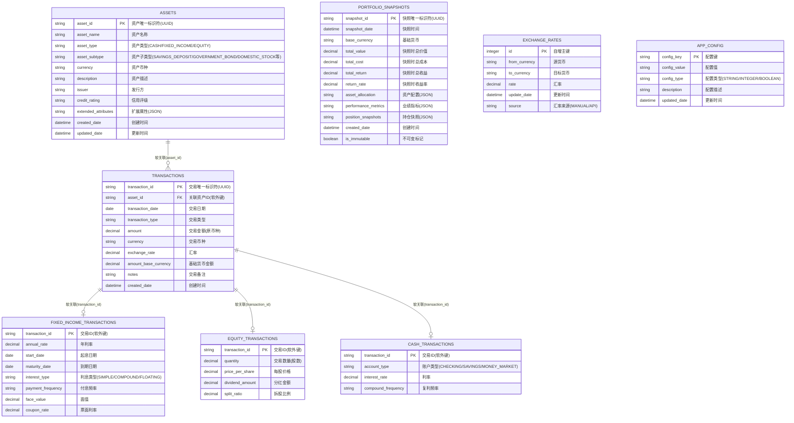

# WealthLite 数据库架构设计

## 概述

本文档详细描述了WealthLite系统采用的SQLite数据库架构设计，包括表结构、索引、关系和约束等。

## 设计原则

- **规范化**：避免数据冗余，保持数据一致性
- **性能优化**：合理设计索引，提高查询效率
- **扩展性**：预留扩展空间，支持新功能开发
- **简洁性**：保持轻量化，避免过度设计

## 数据库文件结构

```
user_data/
├── wealth_lite.db          # 主数据库文件
├── wealth_lite.db.backup   # 自动备份文件
└── config/
    └── db_version.json     # 数据库版本信息
```

## 表结构设计

### 1. ASSETS 表（资产基础信息）

```sql
CREATE TABLE assets (
    asset_id TEXT PRIMARY KEY,
    asset_name TEXT NOT NULL,
    asset_type TEXT NOT NULL,
    asset_subtype TEXT,
    currency TEXT NOT NULL DEFAULT 'CNY',
    description TEXT,
    issuer TEXT,
    credit_rating TEXT,
    extended_attributes TEXT,
    created_date DATETIME NOT NULL DEFAULT CURRENT_TIMESTAMP,
    updated_date DATETIME NOT NULL DEFAULT CURRENT_TIMESTAMP
);

-- 索引
CREATE INDEX idx_assets_type ON assets(asset_type);
CREATE INDEX idx_assets_subtype ON assets(asset_subtype);
CREATE INDEX idx_assets_currency ON assets(currency);
```

**字段说明**：
- `asset_id`: 资产唯一标识符（UUID）
- `asset_name`: 资产名称
- `asset_type`: 资产类型（第一层分类：CASH, FIXED_INCOME, EQUITY）
- `asset_subtype`: 资产子类型（第二层分类：SAVINGS_DEPOSIT, GOVERNMENT_BOND, DOMESTIC_STOCK等）
- `currency`: 资产币种
- `description`: 资产描述
- `issuer`: 发行方（可选）
- `credit_rating`: 信用评级（可选）
- `extended_attributes`: 扩展属性（JSON格式，可选）

### 2. TRANSACTIONS 表（交易记录）

```sql
CREATE TABLE transactions (
    transaction_id TEXT PRIMARY KEY,
    asset_id TEXT NOT NULL,
    transaction_date DATE NOT NULL,
    transaction_type TEXT NOT NULL,  -- 'BUY', 'SELL', 'DEPOSIT', 'WITHDRAW', 'INTEREST', 'DIVIDEND'
    amount DECIMAL(15,4) NOT NULL,
    currency TEXT NOT NULL,
    exchange_rate DECIMAL(10,6) NOT NULL DEFAULT 1.0,
    amount_base_currency DECIMAL(15,4) NOT NULL,
    notes TEXT,
    created_date DATETIME NOT NULL DEFAULT CURRENT_TIMESTAMP
    -- 注意：使用软外键关联，无强制外键约束
);

-- 索引
CREATE INDEX idx_transactions_asset ON transactions(asset_id);
CREATE INDEX idx_transactions_date ON transactions(transaction_date);
CREATE INDEX idx_transactions_type ON transactions(transaction_type);
CREATE INDEX idx_transactions_currency ON transactions(currency);
```

**字段说明**：
- `transaction_id`: 交易唯一标识符（UUID）
- `asset_id`: 关联的资产ID（软关联）
- `transaction_date`: 交易日期
- `transaction_type`: 交易类型（BUY, SELL, DEPOSIT, WITHDRAW, INTEREST, DIVIDEND等）
- `amount`: 交易金额（原币种）
- `currency`: 交易币种
- `exchange_rate`: 对基础货币的汇率
- `amount_base_currency`: 基础货币金额
- `notes`: 交易备注

### 3. FIXED_INCOME_TRANSACTIONS 表（固定收益交易详情）

```sql
CREATE TABLE fixed_income_transactions (
    transaction_id TEXT PRIMARY KEY,  -- 软关联到transactions.transaction_id
    annual_rate DECIMAL(8,4),
    start_date DATE,
    maturity_date DATE,
    interest_type TEXT,  -- 'SIMPLE', 'COMPOUND', 'FLOATING'
    payment_frequency TEXT,  -- 'MATURITY', 'MONTHLY', 'QUARTERLY', 'ANNUALLY'
    face_value DECIMAL(15,4),
    coupon_rate DECIMAL(8,4)
    -- 注意：无外键约束，关联逻辑在软件层处理
);

-- 索引
CREATE INDEX idx_fixed_income_transaction_id ON fixed_income_transactions(transaction_id);
CREATE INDEX idx_fixed_income_maturity ON fixed_income_transactions(maturity_date);
CREATE INDEX idx_fixed_income_rate ON fixed_income_transactions(annual_rate);
```

**字段说明**：
- `transaction_id`: 关联的交易ID（软关联）
- `annual_rate`: 年利率（百分比）
- `start_date`: 起息日期
- `maturity_date`: 到期日期
- `interest_type`: 利息类型（SIMPLE, COMPOUND, FLOATING）
- `payment_frequency`: 付息频率（MATURITY, MONTHLY, QUARTERLY, ANNUALLY）
- `face_value`: 面值
- `coupon_rate`: 票面利率

### 4. EQUITY_TRANSACTIONS 表（权益类交易详情）

```sql
CREATE TABLE equity_transactions (
    transaction_id TEXT PRIMARY KEY,  -- 软关联到transactions.transaction_id
    quantity DECIMAL(15,6),
    price_per_share DECIMAL(15,4),
    dividend_amount DECIMAL(15,4),
    split_ratio DECIMAL(8,4)
    -- 注意：无外键约束，关联逻辑在软件层处理
);

-- 索引
CREATE INDEX idx_equity_transaction_id ON equity_transactions(transaction_id);
CREATE INDEX idx_equity_price ON equity_transactions(price_per_share);
CREATE INDEX idx_equity_quantity ON equity_transactions(quantity);
```

**字段说明**：
- `transaction_id`: 关联的交易ID（软关联）
- `quantity`: 交易数量（股数）
- `price_per_share`: 每股价格
- `dividend_amount`: 分红金额
- `split_ratio`: 拆股比例

### 5. CASH_TRANSACTIONS 表（现金类交易详情）

```sql
CREATE TABLE cash_transactions (
    transaction_id TEXT PRIMARY KEY,  -- 软关联到transactions.transaction_id
    account_type TEXT,  -- 'CHECKING', 'SAVINGS', 'MONEY_MARKET'
    interest_rate DECIMAL(8,4),
    compound_frequency TEXT  -- 'DAILY', 'MONTHLY', 'QUARTERLY', 'ANNUALLY'
    -- 注意：无外键约束，关联逻辑在软件层处理
);

-- 索引
CREATE INDEX idx_cash_transaction_id ON cash_transactions(transaction_id);
CREATE INDEX idx_cash_account_type ON cash_transactions(account_type);
CREATE INDEX idx_cash_interest_rate ON cash_transactions(interest_rate);
```

**字段说明**：
- `transaction_id`: 关联的交易ID（软关联）
- `account_type`: 账户类型（活期、储蓄、货币市场等）
- `interest_rate`: 利率（百分比）
- `compound_frequency`: 复利频率

### 6. REAL_ESTATE_TRANSACTIONS 表（房产交易详情）

```sql
CREATE TABLE real_estate_transactions (
    transaction_id TEXT PRIMARY KEY,  -- 软关联到transactions.transaction_id
    property_area DECIMAL(10,2),
    price_per_unit DECIMAL(15,4),
    rental_income DECIMAL(15,4),
    property_type TEXT  -- 'RESIDENTIAL', 'COMMERCIAL', 'LAND'
    -- 注意：无外键约束，关联逻辑在软件层处理
);

-- 索引
CREATE INDEX idx_real_estate_transaction_id ON real_estate_transactions(transaction_id);
CREATE INDEX idx_real_estate_type ON real_estate_transactions(property_type);
CREATE INDEX idx_real_estate_price ON real_estate_transactions(price_per_unit);
```

**字段说明**：
- `transaction_id`: 关联的交易ID（软关联）
- `property_area`: 物业面积
- `price_per_unit`: 单价
- `rental_income`: 租金收入
- `property_type`: 物业类型（住宅、商业、土地等）

### 7. PORTFOLIO_SNAPSHOTS 表（投资组合快照）

```sql
CREATE TABLE portfolio_snapshots (
    snapshot_id TEXT PRIMARY KEY,
    snapshot_date DATETIME NOT NULL,
    base_currency TEXT NOT NULL,
    total_value DECIMAL(15,4) NOT NULL,
    total_cost DECIMAL(15,4) NOT NULL,
    total_return DECIMAL(15,4) NOT NULL,
    return_rate DECIMAL(8,4) NOT NULL,
    asset_allocation TEXT,  -- JSON格式存储资产配置
    performance_metrics TEXT,  -- JSON格式存储业绩指标
    position_snapshots TEXT,  -- JSON格式存储各持仓快照
    created_date DATETIME NOT NULL DEFAULT CURRENT_TIMESTAMP,
    is_immutable BOOLEAN NOT NULL DEFAULT TRUE  -- 标记为不可变
);

-- 索引
CREATE INDEX idx_snapshots_date ON portfolio_snapshots(snapshot_date);
CREATE INDEX idx_snapshots_currency ON portfolio_snapshots(base_currency);
CREATE INDEX idx_snapshots_immutable ON portfolio_snapshots(is_immutable);
```

**字段说明**：
- `snapshot_id`: 快照唯一标识符（UUID）
- `snapshot_date`: 快照时间
- `base_currency`: 基础货币
- `total_value`: 快照时总价值（基础货币，不可变）
- `total_cost`: 快照时总成本（基础货币，不可变）
- `total_return`: 快照时总收益（基础货币，不可变）
- `return_rate`: 快照时收益率（不可变）
- `asset_allocation`: 快照时资产配置（JSON格式，不可变）
- `performance_metrics`: 快照时业绩指标（JSON格式，不可变）
- `position_snapshots`: 快照时各持仓详细状态（JSON格式，不可变）
- `is_immutable`: 不可变标记，确保快照数据完整性

### 8. EXCHANGE_RATES 表（汇率信息）

```sql
CREATE TABLE exchange_rates (
    id INTEGER PRIMARY KEY AUTOINCREMENT,
    from_currency TEXT NOT NULL,
    to_currency TEXT NOT NULL,
    rate DECIMAL(10,6) NOT NULL,
    update_date DATETIME NOT NULL,
    source TEXT DEFAULT 'MANUAL',
    UNIQUE(from_currency, to_currency, update_date)
);

-- 索引
CREATE INDEX idx_exchange_rates_pair ON exchange_rates(from_currency, to_currency);
CREATE INDEX idx_exchange_rates_date ON exchange_rates(update_date);
```

**字段说明**：
- `from_currency`: 源货币
- `to_currency`: 目标货币
- `rate`: 汇率
- `update_date`: 更新时间
- `source`: 汇率来源（MANUAL, API等）

### 9. APP_CONFIG 表（应用配置）

```sql
CREATE TABLE app_config (
    config_key TEXT PRIMARY KEY,
    config_value TEXT NOT NULL,
    config_type TEXT NOT NULL DEFAULT 'STRING',
    description TEXT,
    updated_date DATETIME NOT NULL DEFAULT CURRENT_TIMESTAMP
);

-- 初始化基础配置
INSERT INTO app_config (config_key, config_value, config_type, description) VALUES
('base_currency', 'CNY', 'STRING', '基础货币'),
('language', 'zh-CN', 'STRING', '界面语言'),
('decimal_places', '2', 'INTEGER', '小数位数'),
('auto_backup', 'true', 'BOOLEAN', '自动备份开关'),
('backup_interval', '7', 'INTEGER', '备份间隔（天）');
```

## ER图（实体关系图）

### 完整数据库ER图



## 关系图说明（软外键关联）

### 主要关系
1. **ASSETS → TRANSACTIONS**：一对多关系，一个资产可以有多笔交易
2. **TRANSACTIONS → 具体交易详情表**：一对一关系，每笔交易对应一个详情记录

### 数据流关系
- **当前Portfolio**：基于TRANSACTIONS表实时计算，不需要持久化存储
- **Portfolio快照**：PORTFOLIO_SNAPSHOTS表存储历史时刻的完整Portfolio状态

### 软外键关联说明
- **无数据库约束**：所有表间关联均采用软外键方式，无数据库级约束
- **软件层保证**：数据完整性和一致性由软件层Repository和Service保证
- **灵活性优势**：提供更好的灵活性和扩展性，避免外键约束限制
- **性能优化**：通过索引优化查询性能，避免外键检查开销

### 关系基数说明
- `||--o{`：一对多关系（一个父记录对应多个子记录）
- `||--o|`：一对一关系（一个父记录对应一个子记录）
- 所有关系都标注为"软关联"，表示通过软件逻辑维护而非数据库约束

## 视图设计

### 1. 持仓汇总视图

```sql
CREATE VIEW v_positions AS
SELECT 
    a.asset_id,
    a.asset_name,
    a.asset_type,
    a.asset_subtype,
    a.currency,
    SUM(CASE WHEN t.transaction_type IN ('BUY', 'DEPOSIT') THEN t.amount ELSE 0 END) as total_invested,
    SUM(CASE WHEN t.transaction_type IN ('SELL', 'WITHDRAW') THEN t.amount ELSE 0 END) as total_withdrawn,
    SUM(CASE WHEN t.transaction_type = 'INTEREST' THEN t.amount ELSE 0 END) as total_interest,
    COUNT(t.transaction_id) as transaction_count,
    MIN(t.transaction_date) as first_transaction_date,
    MAX(t.transaction_date) as last_transaction_date
FROM assets a
LEFT JOIN transactions t ON a.asset_id = t.asset_id
GROUP BY a.asset_id;
```

### 2. 固定收益产品视图

```sql
CREATE VIEW v_fixed_income_positions AS
SELECT 
    p.*,
    f.annual_rate,
    f.start_date,
    f.maturity_date,
    f.interest_type,
    f.payment_frequency,
    CASE 
        WHEN f.maturity_date < DATE('now') THEN 'MATURED'
        WHEN f.maturity_date IS NULL THEN 'ACTIVE'
        ELSE 'ACTIVE'
    END as status,
    JULIANDAY(f.maturity_date) - JULIANDAY(DATE('now')) as days_to_maturity
FROM v_positions p
JOIN transactions t ON p.asset_id = t.asset_id
LEFT JOIN fixed_income_transactions f ON t.transaction_id = f.transaction_id
WHERE p.asset_type = 'FIXED_INCOME';
```

### 3. 权益类产品视图

```sql
CREATE VIEW v_equity_positions AS
SELECT 
    p.*,
    e.quantity,
    e.price_per_share,
    e.dividend_amount,
    e.split_ratio,
    (e.quantity * e.price_per_share) as market_value
FROM v_positions p
JOIN transactions t ON p.asset_id = t.asset_id
LEFT JOIN equity_transactions e ON t.transaction_id = e.transaction_id
WHERE p.asset_type = 'EQUITY';
```

### 4. 完整交易信息视图

```sql
CREATE VIEW v_transaction_details AS
SELECT 
    t.*,
    a.asset_name,
    a.asset_type,
    -- 固定收益详情
    f.annual_rate,
    f.maturity_date,
    f.interest_type,
    -- 权益类详情
    e.quantity,
    e.price_per_share,
    -- 现金详情
    c.account_type,
    c.interest_rate,
    -- 房产详情
    r.property_area,
    r.property_type
FROM transactions t
LEFT JOIN assets a ON t.asset_id = a.asset_id
LEFT JOIN fixed_income_transactions f ON t.transaction_id = f.transaction_id
LEFT JOIN equity_transactions e ON t.transaction_id = e.transaction_id
LEFT JOIN cash_transactions c ON t.transaction_id = c.transaction_id
LEFT JOIN real_estate_transactions r ON t.transaction_id = r.transaction_id;
```

## 触发器

### 1. 更新时间戳触发器

```sql
-- 资产表更新时间戳
CREATE TRIGGER update_assets_timestamp 
AFTER UPDATE ON assets
BEGIN
    UPDATE assets SET updated_date = CURRENT_TIMESTAMP WHERE asset_id = NEW.asset_id;
END;

-- 配置表更新时间戳
CREATE TRIGGER update_config_timestamp 
AFTER UPDATE ON app_config
BEGIN
    UPDATE app_config SET updated_date = CURRENT_TIMESTAMP WHERE config_key = NEW.config_key;
END;
```

### 2. 基础货币金额自动计算

```sql
CREATE TRIGGER calculate_base_currency_amount
BEFORE INSERT ON transactions
BEGIN
    UPDATE transactions SET amount_base_currency = NEW.amount * NEW.exchange_rate
    WHERE transaction_id = NEW.transaction_id;
END;
```

## 数据完整性约束

### 1. 检查约束

```sql
-- 金额必须为正数（除了某些特殊交易类型）
ALTER TABLE transactions ADD CONSTRAINT chk_amount_positive 
CHECK (amount > 0 OR transaction_type IN ('SELL', 'WITHDRAW', 'FEE'));

-- 汇率必须为正数
ALTER TABLE transactions ADD CONSTRAINT chk_exchange_rate_positive 
CHECK (exchange_rate > 0);

-- 年利率范围检查
ALTER TABLE fixed_income_transactions ADD CONSTRAINT chk_annual_rate_range 
CHECK (annual_rate >= 0 AND annual_rate <= 100);
```

## 性能优化

### 1. 索引策略
- 主键自动创建唯一索引
- 外键字段创建普通索引
- 常用查询字段创建复合索引
- 日期字段创建索引支持时间范围查询

### 2. 查询优化
- 使用视图简化复杂查询
- 避免SELECT *，只查询需要的字段
- 合理使用JOIN，避免笛卡尔积
- 使用LIMIT分页查询大量数据

### 3. 存储优化
- 使用适当的数据类型减少存储空间
- JSON字段存储复杂结构数据
- 定期清理过期的快照数据

## 备份和恢复

### 1. 自动备份策略
```sql
-- 备份命令（应用程序执行）
.backup user_data/wealth_lite.db.backup

-- 恢复命令
.restore user_data/wealth_lite.db.backup
```

### 2. 数据导出
```sql
-- 导出为CSV格式
.mode csv
.output user_data/exports/transactions.csv
SELECT * FROM transactions;
```

## 版本管理

### 1. 数据库版本控制
```json
{
    "version": "1.0.0",
    "created_date": "2024-01-01",
    "last_migration": "2024-01-01",
    "migrations": [
        {
            "version": "1.0.0",
            "description": "初始数据库结构",
            "applied_date": "2024-01-01"
        }
    ]
}
```

### 2. 迁移脚本管理
- 每个版本升级提供对应的SQL迁移脚本
- 支持向前和向后兼容
- 数据迁移前自动备份

---

*文档版本：v1.0*  
*创建日期：2025年6月21日*  
*最后更新：2025年6月21日* 