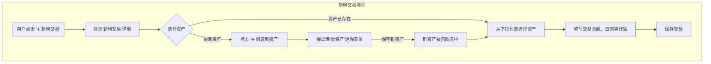

# WealthLite UI 模块设计文档

基于实际演示界面的完整UI模块设计规范。

**最后更新**: 2025-06-22 17:36:38

## 🛠️ 技术栈说明

### 核心技术架构
WealthLite UI 采用**轻量化原生Web技术栈**，无需复杂框架，专注于本地应用的快速响应和简洁维护。

### 前端技术栈

#### 1. 基础技术
- **HTML5**: 语义化标记，支持现代Web标准
- **CSS3**: 原生CSS，使用CSS变量和现代布局
- **JavaScript ES6+**: 原生JavaScript，面向对象设计

#### 2. 外部依赖库
```html
<!-- 图表可视化 -->
<script src="https://cdn.jsdelivr.net/npm/chart.js"></script>

<!-- 图标系统 -->
<script src="https://unpkg.com/lucide@latest/dist/umd/lucide.js"></script>

<!-- 开发工具（仅开发环境） -->
<script src="https://unpkg.com/@stagewise/toolbar@latest/dist/toolbar.min.js"></script>
```

#### 3. 技术特性
- **Chart.js**: 轻量级图表库，支持响应式图表
- **Lucide Icons**: 现代化SVG图标库，支持动态渲染
- **CSS Grid + Flexbox**: 现代布局系统
- **CSS Variables**: 统一的设计系统管理
- **Backdrop Filter**: 毛玻璃效果（现代浏览器支持）

### 架构设计原则

#### 1. 轻量化优先
- **无框架依赖**: 避免React/Vue等重型框架
- **CDN加载**: 外部库通过CDN加载，减少打包体积
- **原生API**: 充分利用现代浏览器原生API

#### 2. 本地应用优化
- **快速启动**: 最小化资源加载时间
- **离线友好**: 核心功能支持离线使用
- **资源控制**: 精确控制资源加载和缓存

#### 3. 维护性设计
- **模块化CSS**: 按功能模块组织样式文件
- **组件化JS**: 面向对象的JavaScript架构
- **统一规范**: CSS变量统一管理设计系统

### 文件结构
```
ui/
├── index.html              # 主页面入口
├── demo_modules.html       # 完整模块演示
├── demo.html              # 基础演示
├── start_demo.py          # 本地服务器启动脚本
├── js/
│   ├── main.js            # 主应用逻辑（460行）
│   └── charts.js          # 图表管理器（435行）
├── styles/
│   ├── main.css           # 主样式文件（440行）
│   └── dashboard.css      # 仪表板专用样式（459行）
└── stagewise-toolbar.js   # 开发工具集成（491行）
```

### JavaScript架构

#### 1. 主应用类 (WealthLiteApp)
```javascript
class WealthLiteApp {
    constructor() {
        this.currentCurrency = 'CNY';
        this.currentPage = 'dashboard';
        this.exchangeRates = {...};
    }
    
    // 核心功能
    - 页面导航管理
    - 币种切换逻辑
    - 键盘快捷键支持
    - 数据格式化处理
}
```

#### 2. 图表管理器 (ChartManager)
```javascript
class ChartManager {
    constructor() {
        this.charts = {};
        this.chartColors = {...};
    }
    
    // 图表功能
    - Chart.js集成
    - 韩式仪表板风格
    - 响应式图表
    - 自定义tooltip
}
```

### CSS架构

#### 1. 设计系统
```css
:root {
    /* 色彩系统 */
    --primary-gradient: linear-gradient(135deg, #667eea 0%, #764ba2 100%);
    --accent-gradient: linear-gradient(135deg, #4facfe 0%, #00f2fe 100%);
    
    /* 功能色 */
    --success: #10b981;
    --danger: #ef4444;
    --warning: #f59e0b;
    --info: #3b82f6;
    
    /* 布局系统 */
    --spacing: 1rem;
    --radius-lg: 1rem;
    --shadow-lg: 0 10px 15px -3px rgb(0 0 0 / 0.1);
}
```

#### 2. 响应式设计
- **断点**: 768px (移动端) / 1200px (桌面端)
- **网格系统**: CSS Grid自适应布局
- **弹性组件**: Flexbox灵活排列

### 服务器技术

#### Python HTTP服务器
```python
# start_demo.py - 本地开发服务器
class WealthLiteHandler(SimpleHTTPRequestHandler):
    - CORS支持
    - 静态文件服务
    - 端口自动检测
    - 浏览器自动打开
```

### 开发工具集成

#### 1. Stagewise Toolbar
- **用途**: 开发环境调试工具
- **特性**: 非侵入式集成，仅开发环境加载
- **功能**: 实时调试、性能监控

#### 2. 本地服务器
- **端口**: 自动检测8000-8099可用端口
- **CORS**: 完整跨域支持
- **热重载**: 文件变更自动刷新

### 浏览器兼容性

#### 支持的现代特性
- **CSS Grid**: IE11+, 所有现代浏览器
- **CSS Variables**: Chrome 49+, Firefox 31+, Safari 9.1+
- **Backdrop Filter**: Chrome 76+, Firefox 103+, Safari 9+
- **ES6 Classes**: Chrome 49+, Firefox 45+, Safari 9+

#### 优雅降级
- **毛玻璃效果**: 不支持时使用半透明背景
- **CSS Grid**: 回退到Flexbox布局
- **现代JavaScript**: 使用Babel转译（如需支持旧浏览器）

### 性能优化

#### 1. 资源加载
- **CDN优先**: 外部库使用CDN加速
- **按需加载**: 开发工具仅开发环境加载
- **资源压缩**: CSS/JS文件优化

#### 2. 运行时优化
- **事件委托**: 减少事件监听器数量
- **防抖节流**: 搜索和resize事件优化
- **虚拟滚动**: 大数据列表优化（待实现）

### 部署方案

#### 1. 本地应用
- **Python服务器**: 内置HTTP服务器
- **单文件打包**: PyInstaller支持
- **跨平台**: Windows/macOS/Linux

#### 2. Web部署
- **静态托管**: 支持任何静态文件服务器
- **CDN集成**: 外部依赖自动CDN加载
- **离线支持**: Service Worker（待实现）

---

## 🎨 设计原则

### 视觉风格
- **主题色调**: 蓝紫渐变背景 (`linear-gradient(135deg, #667eea 0%, #764ba2 100%)`)
- **卡片设计**: 白色圆角卡片，大阴影效果
- **布局方式**: 响应式网格布局，最大宽度1400px居中
- **交互模式**: 现代化微交互，悬停效果，平滑动画

### 色彩系统
```css
--primary-gradient: linear-gradient(135deg, #667eea 0%, #764ba2 100%);
--accent-gradient: linear-gradient(135deg, #4facfe 0%, #00f2fe 100%);
--success: #10b981;
--danger: #ef4444;
--warning: #f59e0b;
--info: #3b82f6;
--white: #ffffff;
--gray-系列: #f8fafc 到 #0f172a;
```

### 字体系统
- **字体族**: 'Inter', 'PingFang SC', 'Microsoft YaHei', sans-serif
- **层次结构**: 标题2rem/1.25rem，正文0.875rem，小字0.75rem

## 📱 整体架构

### 布局结构
```
┌─────────────────────────────────────────────────────────┐
│ 🔝 顶部导航栏 (Navbar)                                  │
│ ├── Logo区域 (💰 WealthLite)                           │
│ ├── 主导航菜单 (5个模块)                                │
│ └── 币种切换按钮                                        │
├─────────────────────────────────────────────────────────┤
│ 📄 主内容区域 (Main Content)                           │
│ └── 页面容器 (单页面应用，页面切换)                      │
└─────────────────────────────────────────────────────────┘
```

### 导航系统
- **顶部导航**: 半透明毛玻璃效果，固定定位
- **导航项目**: 图标+文字，悬停高亮，活跃状态标识
- **响应式**: 移动端隐藏导航菜单

## 🏠 模块一：仪表板 (Dashboard)

### 布局结构
```
┌─────────────────────────────────────────────────────────┐
│ 📊 仪表板模块 (白色标题)                                │
├─────────────────────────────────────────────────────────┤
│ 💰 关键指标网格 (4列自适应)                             │
│ ┌─────────────┬─────────────┬─────────────┬─────────────┐ │
│ │ 总资产价值   │ 现金类资产   │ 固定收益     │ 年化收益率   │ │
│ │ 2,341,270   │ 1,234,000   │ 1,107,270   │ 12.5%       │ │
│ │ +8,750(+5.85%) │ +12,340(+1.2%) │ +23,450(+2.8%) │ +0.8%    │ │
│ └─────────────┴─────────────┴─────────────┴─────────────┘ │
├─────────────────────────────────────────────────────────┤
│ 📈 主图表卡片                                           │
│ ├── 卡片标题: "资产趋势"                                │
│ ├── 时间切换按钮: 7天/1月/3月/1年                       │
│ └── 图表容器: 资产总览趋势图 (Chart.js)                 │
├─────────────────────────────────────────────────────────┤
│ 📊 资产分布 (2列网格)                                   │
│ ┌─────────────────────────┬─────────────────────────────┐ │
│ │ 资产类型分布            │ 币种分布                    │ │
│ │ 🥧 饼图                 │ 🍩 环形图                   │ │
│ └─────────────────────────┴─────────────────────────────┘ │
└─────────────────────────────────────────────────────────┘
```

### 数据展示特性
- **关键指标卡片**: 大数字显示，彩色变化指示器
- **图表交互**: 时间范围按钮切换，活跃状态标识
- **响应式网格**: 桌面4列，平板2列，手机1列

## 🪙 模块二：资产管理 (Assets)

### 布局结构
```
┌─────────────────────────────────────────────────────────┐
│ 🪙 资产管理模块 (白色标题)                               │
├─────────────────────────────────────────────────────────┤
│ 🔧 工具栏卡片                                           │
│ ├── 搜索框: "搜索资产名称或符号..."                      │
│ ├── 筛选器: 类型/币种下拉选择                           │
│ ├── 主操作: ➕ 添加资产                                 │
│ └── 辅助操作: 📤 导出                                   │
├─────────────────────────────────────────────────────────┤
│ 📋 资产列表卡片                                         │
│ ├── 卡片标题: "资产列表" + 统计徽章                     │
│ └── 数据表格:                                           │
│     ┌─────────┬──────┬──────┬──────┬────────┬────────┬────┐ │
│     │ 资产名称 │ 类型 │ 符号 │ 币种 │ 当前价值 │ 收益率 │操作│ │
│     ├─────────┼──────┼──────┼──────┼────────┼────────┼────┤ │
│     │ 现金账户 │[现金]│CASH  │ CNY  │ 65,000 │ +2.1% │查看│ │
│     │ 国债2024 │[固收]│GB2024│ CNY  │100,000 │ +3.8% │编辑│ │
│     └─────────┴──────┴──────┴──────┴────────┴────────┴────┘ │
├─────────────────────────────────────────────────────────┤
│ 📊 资产统计卡片 (2列网格)                               │
│ ┌─────────────────────────┬─────────────────────────────┐ │
│ │ 按类型统计柱状图        │ 资产增长趋势图              │ │
│ └─────────────────────────┴─────────────────────────────┘ │
└─────────────────────────────────────────────────────────┘
```

### 功能特性
- **彩色徽章系统**: 不同资产类型用不同颜色标识
- **表格交互**: 悬停高亮，小按钮操作
- **搜索筛选**: 多维度筛选组合

## 📋 模块三：交易记录 (Transactions)

### 布局结构
```
┌─────────────────────────────────────────────────────────┐
│ 📋 交易记录模块 (白色标题)                               │
├─────────────────────────────────────────────────────────┤
│ 📊 交易统计网格 (3列)                                   │
│ ┌─────────────┬─────────────┬─────────────────────────┐   │
│ │ 本月交易笔数 │ 本月交易金额 │ 本月收益                │   │
│ │ 156 (+23)   │1,234,567(+15.6%) │ 23,456(+12.3%)     │   │
│ └─────────────┴─────────────┴─────────────────────────┘   │
├─────────────────────────────────────────────────────────┤
│ 🔧 工具栏卡片                                           │
│ ├── 日期范围: 开始日期 至 结束日期                       │
│ ├── 筛选器: 交易类型/资产选择                           │
│ ├── 主操作: ➕ 新增交易                                 │
│ └── 辅助操作: 📤 导出                                   │
├─────────────────────────────────────────────────────────┤
│ 📋 交易列表卡片                                         │
│ ├── 卡片标题: "交易记录" + 统计徽章                     │
│ └── 数据表格:                                           │
│     ┌──────┬────────┬────────┬──────┬──────┬──────┬────┬────┐ │
│     │ 日期 │ 资产   │交易类型│ 数量 │ 价格 │ 金额 │备注│操作│ │
│     ├──────┼────────┼────────┼──────┼──────┼──────┼────┼────┤ │
│     │6/21  │现金账户│[存入]  │10,000│ 1.00 │10,000│工资│查看│ │
│     │6/20  │国债2024│[购买]  │ 1    │100K  │100K  │投资│删除│ │
│     └──────┴────────┴────────┴──────┴──────┴──────┴────┴────┘ │
├─────────────────────────────────────────────────────────┤
│ 📊 交易分析卡片 (2列网格)                               │
│ ┌─────────────────────────┬─────────────────────────────┐ │
│ │ 月度交易量趋势          │ 交易类型分布饼图            │ │
│ └─────────────────────────┴─────────────────────────────┘ │
└─────────────────────────────────────────────────────────┘
```

### 交易类型徽章
- **存入 (DEPOSIT)**: 绿色徽章
- **购买 (PURCHASE)**: 蓝色徽章
- **赎回 (REDEMPTION)**: 橙色徽章
- **利息 (INTEREST)**: 紫色徽章

### 核心交互：集成式交易创建
为确保数据完整性并优化用户体验，系统采用集成式交易创建流程。用户无需在“资产管理”和“交易记录”两个模块间切换，即可在新增交易的同时创建新资产。

#### 交互原则
- **交易必须关联资产**: 系统强制要求每一笔交易都必须归属到一个明确的资产。
- **流畅的操作路径**: 用户在单一表单或弹窗内即可完成“选择/创建资产”和“录入交易”的全部操作，最大限度减少页面跳转。

#### 交互流程图


#### 步骤分解
1.  **触发操作**: 用户在“交易记录”模块点击 `➕ 新增交易` 按钮。
2.  **显示弹窗**: 系统弹出一个用于新增交易的模态窗口（Modal）。
3.  **选择资产**: 
    -   弹窗内的第一个字段是 **资产选择器**，它是一个支持搜索的下拉列表，默认加载所有已存在的资产。
    -   用户可以在列表中选择一个已有的资产。
4.  **即时创建新资产**:
    -   如果在列表中找不到目标资产，用户可以点击资产选择器旁边的 `➕ 创建新资产` 按钮。
    -   系统会再弹出一个更轻量的 **新增资产** 迷你表单，只包含创建资产的核心字段（如：资产名称、类型、币种）。
    -   用户填写完毕并保存后，这个迷你表单关闭。
5.  **自动关联**: 新创建的资产会自动出现在“新增交易”弹窗的资产选择器中，并处于选中状态。
6.  **录入交易详情**: 用户在选定资产后，继续填写交易类型、金额、日期、备注等信息。
7.  **完成**: 点击保存，完成交易录入，弹窗关闭。

## 📊 模块四：投资组合 (Portfolio)

### 布局结构
```
┌─────────────────────────────────────────────────────────┐
│ 📊 投资组合模块 (白色标题)                               │
├─────────────────────────────────────────────────────────┤
│ 📊 组合总览网格 (4列)                                   │
│ ┌─────────────┬─────────────┬─────────────┬─────────────┐ │
│ │ 总资产      │ 总收益      │ 年化收益率   │ 风险等级    │ │
│ │ 2,341,270   │ +234,127    │ +12.5%      │ 中等       │ │
│ └─────────────┴─────────────┴─────────────┴─────────────┘ │
├─────────────────────────────────────────────────────────┤
│ 📊 资产配置分析卡片 (3列网格)                           │
│ ┌─────────────┬─────────────┬─────────────────────────┐   │
│ │ 按类型分布   │ 按币种分布   │ 按风险分布              │   │
│ │ [饼图]      │ [环形图]    │ [柱状图]                │   │
│ └─────────────┴─────────────┴─────────────────────────┘   │
├─────────────────────────────────────────────────────────┤
│ 📈 收益分析卡片 (2:1网格)                               │
│ ┌─────────────────────────┬─────────────────────────────┐ │
│ │ 历史收益曲线图          │ 收益统计                    │ │
│ │                         │ ┌─────────────────────────┐ │ │
│ │                         │ │ 今年收益率: +23.4%      │ │ │
│ │                         │ │ 今年收益金额: +156,789  │ │ │
│ │                         │ │ 最大回撤: -5.2%         │ │ │
│ │                         │ └─────────────────────────┘ │ │
│ └─────────────────────────┴─────────────────────────────┘ │
├─────────────────────────────────────────────────────────┤
│ 🎯 风险评估卡片 (2列网格)                               │
│ ┌─────────────────────────┬─────────────────────────────┐ │
│ │ 风险收益散点图          │ VaR风险价值分析             │ │
│ └─────────────────────────┴─────────────────────────────┘ │
└─────────────────────────────────────────────────────────┘
```

### 数据可视化特色
- **多维度分析**: 类型、币种、风险三维度图表
- **收益统计面板**: 关键指标垂直排列
- **风险评估**: 专业金融图表展示

## ⚙️ 模块五：设置 (Settings)

### 布局结构
```
┌─────────────────────────────────────────────────────────┐
│ ⚙️ 设置模块 (白色标题)                                   │
├─────────────────────────────────────────────────────────┤
│ 🖥️ 显示设置卡片 (2列网格)                               │
│ ┌─────────────────────────┬─────────────────────────────┐ │
│ │ 默认币种                │ 数字格式                    │ │
│ │ [CNY - 人民币 ▼]        │ [1,234.56 ▼]               │ │
│ └─────────────────────────┴─────────────────────────────┘ │
├─────────────────────────────────────────────────────────┤
│ 💾 数据设置卡片 (2列网格)                               │
│ ┌─────────────────────────┬─────────────────────────────┐ │
│ │ 自动刷新间隔            │ 数据保留期                  │ │
│ │ [实时 ▼]                │ [永久保留 ▼]               │ │
│ └─────────────────────────┴─────────────────────────────┘ │
├─────────────────────────────────────────────────────────┤
│ 📁 数据管理卡片 (2列网格)                               │
│ ┌─────────────────────────┬─────────────────────────────┐ │
│ │ 数据导出                │ 数据导入                    │ │
│ │ ┌─────────────────────┐ │ ┌─────────────────────────┐ │ │
│ │ │📤 导出所有数据(JSON)│ │ │📥 导入数据文件          │ │ │
│ │ │📊 导出Excel报表     │ │ │🔄 恢复备份              │ │ │
│ │ │📋 导出CSV文件       │ │ │🗑️ 清空所有数据         │ │ │
│ │ └─────────────────────┘ │ └─────────────────────────┘ │ │
│ └─────────────────────────┴─────────────────────────────┘ │
├─────────────────────────────────────────────────────────┤
│ 🔍 系统信息卡片 (2列网格)                               │
│ ┌─────────────────────────┬─────────────────────────────┐ │
│ │ 系统信息表格            │ 使用统计                    │ │
│ │ ┌─────────┬───────────┐ │ ┌─────────────────────────┐ │ │
│ │ │应用版本 │ 1.0.0     │ │ │ 总交易笔数: 1,234       │ │ │
│ │ │数据库版本│SQLite 3.45│ │ │ 管理资产数: 15          │ │ │
│ │ │最后备份 │6/21 19:30 │ │ │ 使用天数: 89            │ │ │
│ │ │数据库大小│ 2.3 MB    │ │ └─────────────────────────┘ │ │
│ │ └─────────┴───────────┘ │                             │ │
│ └─────────────────────────┴─────────────────────────────┘ │
└─────────────────────────────────────────────────────────┘
```

### 设置分类
- **显示设置**: 用户界面偏好
- **数据设置**: 系统行为配置  
- **数据管理**: 导入导出功能
- **系统信息**: 版本和统计信息

## 🎯 交互设计规范

### 按钮系统
- **主按钮**: 渐变背景 (`--accent-gradient`)，白色文字
- **次按钮**: 灰色背景 (`--gray-100`)，深色文字
- **小按钮**: 0.25rem padding，0.75rem字体
- **悬停效果**: 向上平移1px，添加阴影

### 表格设计
- **表头**: 灰色背景，加粗字体，小字号
- **行悬停**: 浅灰背景高亮
- **边框**: 底部细线分隔

### 卡片设计
- **背景**: 纯白色
- **圆角**: 1rem
- **阴影**: 大阴影效果 (`--shadow-lg`)
- **间距**: 2rem内边距，2rem底部外边距

### 徽章系统
```css
.badge-success { background: #10b981; color: white; }
.badge-warning { background: #f59e0b; color: white; }
.badge-info { background: #3b82f6; color: white; }
```

## 📱 响应式设计

### 断点系统
- **桌面端 (>768px)**: 完整布局，多列网格
- **移动端 (≤768px)**: 
  - 隐藏导航菜单
  - 单列堆叠布局
  - 减少内边距
  - 工具栏垂直排列

### 网格适配
- **统计卡片**: 桌面4列 → 移动1列
- **图表网格**: 桌面2列 → 移动1列
- **表格**: 水平滚动处理

## 🔄 页面切换机制

### 单页面应用 (SPA)
- **导航状态**: 活跃项目高亮显示
- **页面切换**: JavaScript控制显示/隐藏
- **动画效果**: fadeIn 0.3s 淡入动画
- **URL管理**: 基于data-page属性

### 状态管理
- **加载状态**: 图表容器占位符
- **交互反馈**: 控制台日志输出
- **币种切换**: 循环切换演示

## 📊 图表占位符系统

当前使用文字占位符，便于后续集成Chart.js：
- **📈 折线图**: 趋势展示
- **🥧 饼图**: 占比分布  
- **🍩 环形图**: 多层数据
- **📊 柱状图**: 对比分析
- **📈 散点图**: 关联分析

---

## 🚀 技术实现要点

### CSS架构
- **CSS变量**: 统一色彩和尺寸管理
- **网格布局**: Grid + Flexbox混合使用
- **响应式**: 媒体查询 + 自适应网格

### JavaScript功能
- **事件委托**: 统一按钮点击处理
- **状态切换**: 导航和页面状态管理
- **演示功能**: 币种切换等交互演示

### 扩展性设计
- **模块化结构**: 每个页面独立容器
- **组件化思维**: 可复用的卡片和按钮样式
- **数据绑定**: 便于后续集成真实数据

这个设计文档完全基于实际的demo_modules.html实现，确保了设计与实现的一致性。 